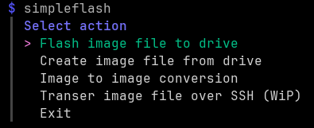

# SimpleFlash

**SimpleFlash** is a **command-line** tool written in **Go** for flashing to and backing up from USB drives following the KISS principle.

It features a simple selection menu and should be easy to use.



## ⚙️ Features

- Flash disk images (`.img`, `.img.xz`, `.img.gz`) onto USB devices
- Create (compressed) raw image backups from USB drives
- Img2Img conversion for (de)compressing image files
- Transfer image file over SSH (experimental)
- Straightforward, no external dependencies
- Interactive TUI using [Charmbracelet Huh](https://github.com/charmbracelet/huh)

## 🧰 Getting Started

### Prerequisites

- Linux
- Go (≥ 1.21 recommended)
- Root access

### Installation

Clone the repository and build:

```bash
git clone https://github.com/zocker-160/simpleflash.git
cd simpleflash
make
```

This will compile the `simpleflash` binary.

Alternatively, install via Go:

```bash
go install github.com/zocker-160/simpleflash@latest
```

## 💻 Usage

```bash
sudo simpleflash <imagefile>
```
`imagefile` option is optional and will be used as source / target when provided.

## 🛡️ License

Released under the **GPL‑3.0 License**. See the [LICENSE](LICENSE) file for full terms.
